# React :: Initiating State 

As we have learned, React is purely front-end and based on changing the display through user input. Due to this, the initial loading time of the application will be longer but the functionality of the application will be faster. Without using a backend, React has to store the data locally. Since React never refreshes the application, this is achieved by setting what is called <b>The State</b>. Understanding states is roughly 90% of React. By the time you finish reading this, I will have given you a basic understanding of states and how React uses them.

## Quick Review 

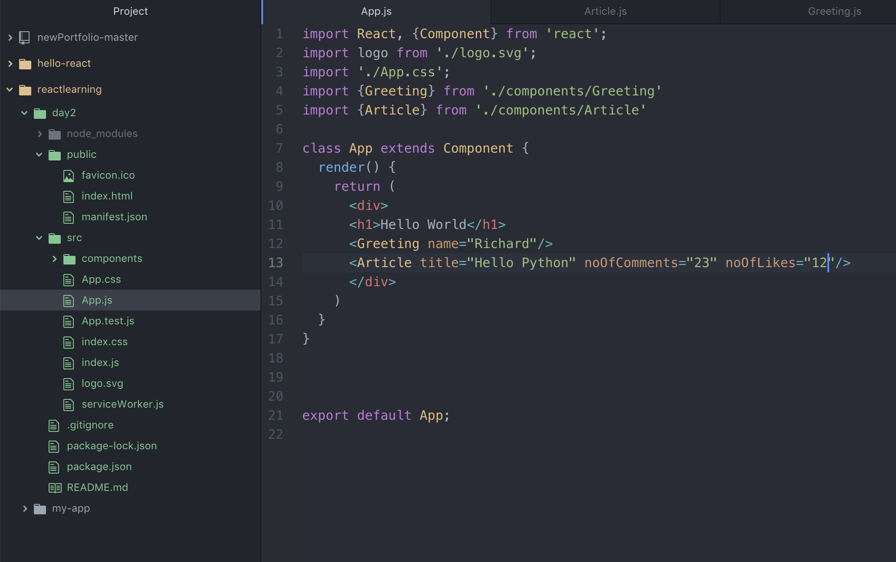
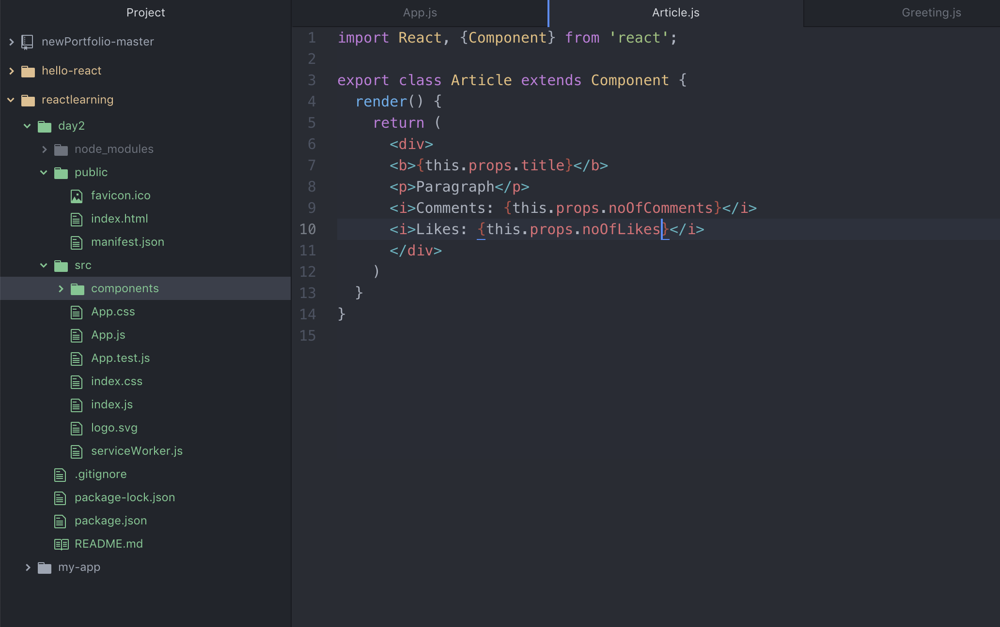

You can set values to your Components in your main App.js. These values will then be displayed on your applicaiton.

 

We then apply styling to the Component, which is then imported into said Component. 

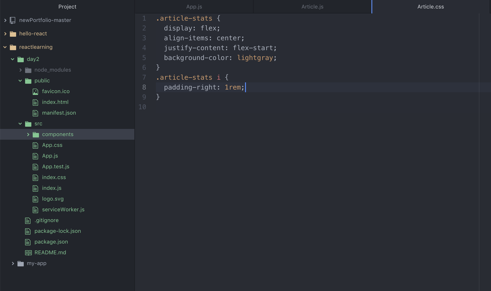
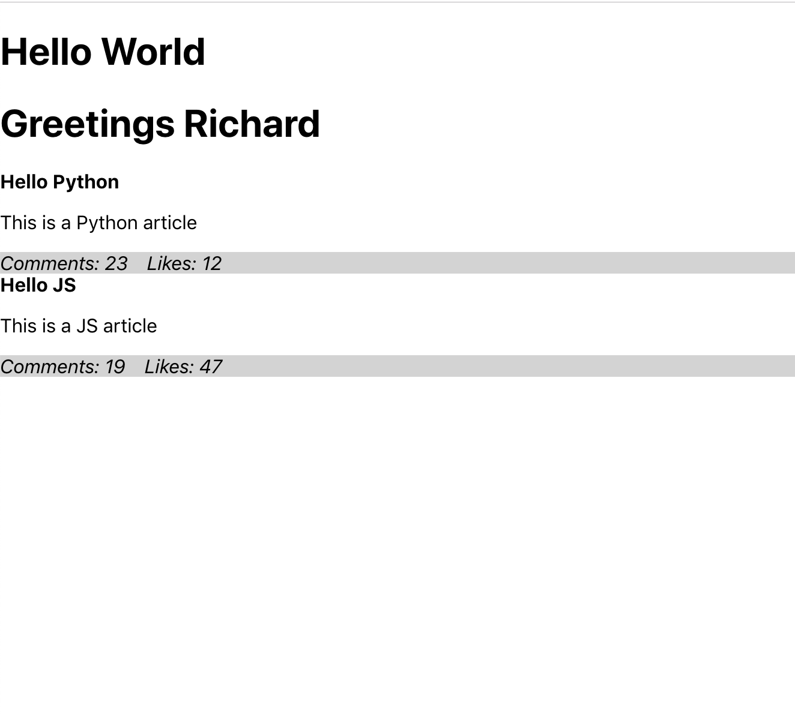

# Setting State in React 

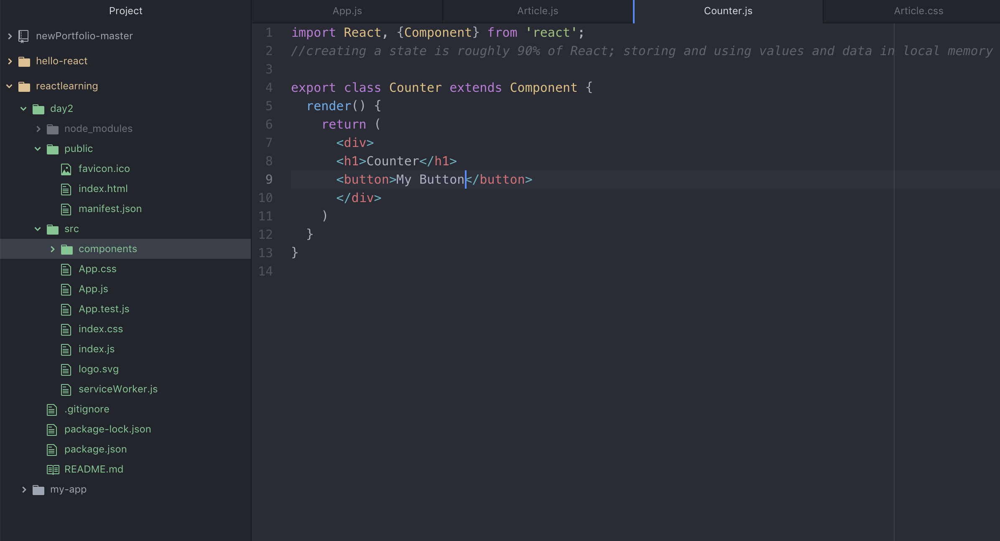

As we have done before, we start by creating a new Component for our Counter. Creating a counter, which can increment a state, is a simple way to start understand React and states. Our goal is to click on the button and have the number increase per click. First, let's make sure we can display the button and counter Component. 

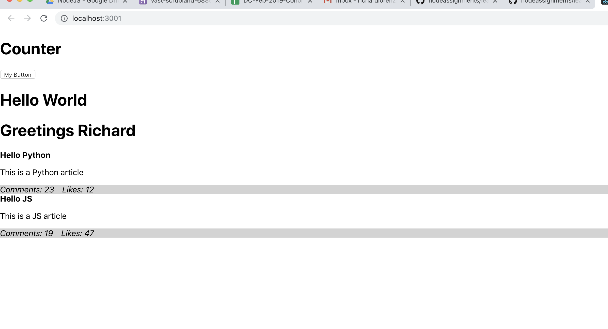

As we've learned before with Classes in JavaScript, a Class can have functions which can be called upon. When creating a function, it can be adventageous to console.log something in order to make sure you are able to call the function in the first place. 

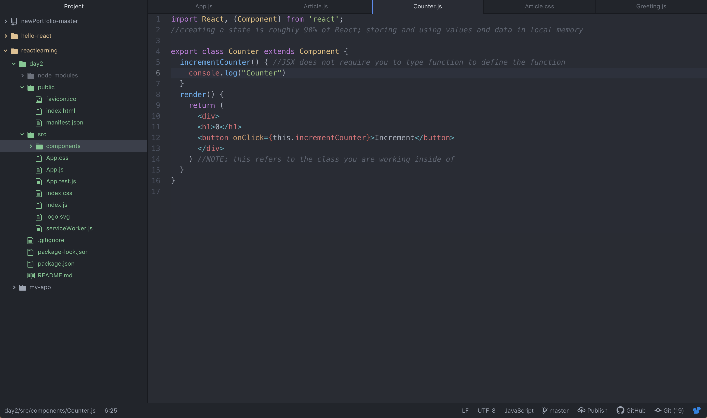
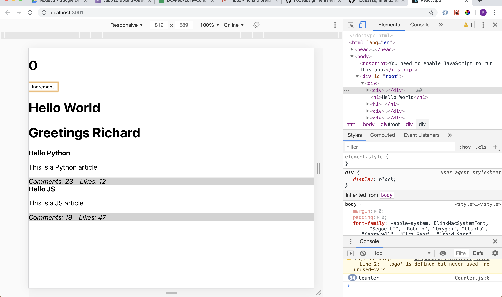

Every time we click on the button, it will console.log "Counter". As we have seen, I clicked the button 34 times. It shows in the developer tools log, but we ultimately want it to display on the application. Before moving forward, we are going to have to create a constructor in order to assign our states. 

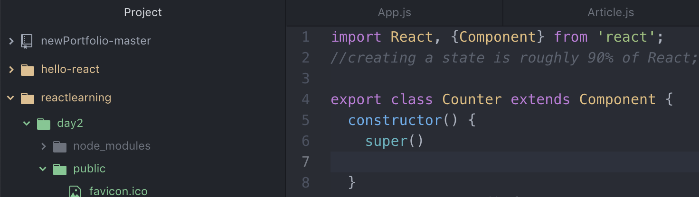 

The ```super()``` function is required in this instance, since this is the parent class for Counter. The constructor now allows us to set values to THIS and STATE. 

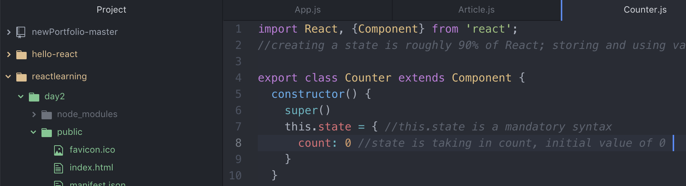

If you recall classes in JavaScript, using a constructor will be familiar. By calling the constructor function, we are able to tell React which states we are going to set and manipulate. Since this is a counter, our state is going to be "count". We can assign multiple states under the constructor, but for now we will focus on a single state. 

# "Changing" The State 

NOTE: You cannot change the state in React. These values are inmutable, meaning unchangeable. React has specific syntaxes to work around this "issue". 

The first way to manipulate a state without changing the value is to define a function and tell React to apply this.Function to this.state.Function. Confused? So was I. 

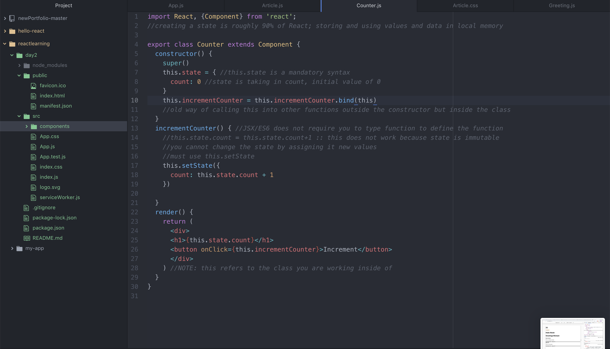 

On line 13, we create a function incrementCounter() and call it on line 26 ```onClick={incremenetCounter}```. Don't stress too much about the new syntax as it's how React calls functions and evaluates values. onClick must have the capital C, unlike in JavaScript, so if you run into error messages make sure your syntaxes are correct.

On line 10 we set our function to BIND to our state of this. Still confused? It definitely can be complicated to understand. Think of it like this: You are telling your function's state to have the value of the class's state. Without this line, the function's state for "this" will be undefined. 

 

Our counter now works, but we can simplify the functions and reduce the lines of code we need to write. 

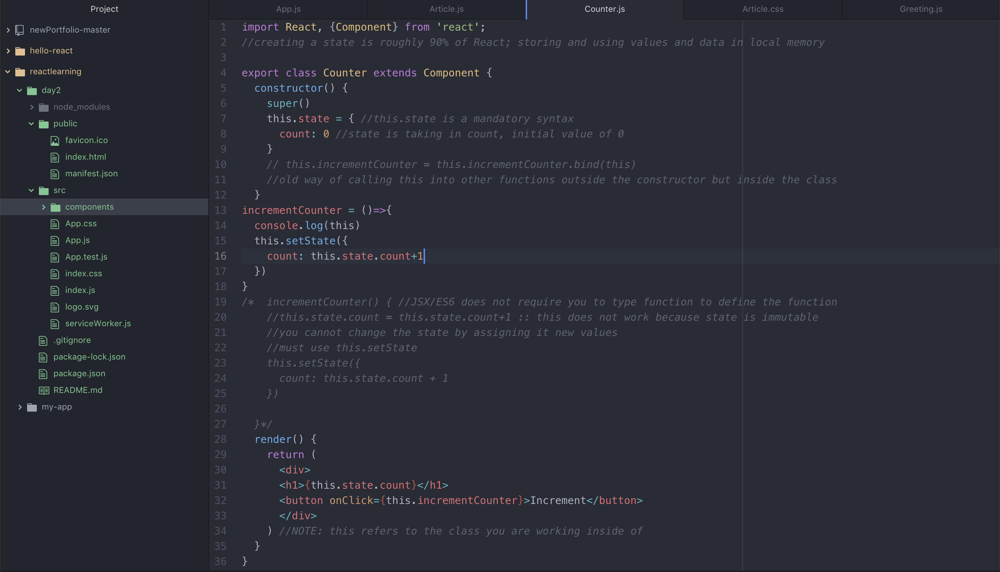 

Lines 13 through 18 replace the previous function and this.state we have set up above. We are using an anonymous function called incrementCounter and setting the state of count to increase every time the function is called. Like before, the button is still assigned to the function. 

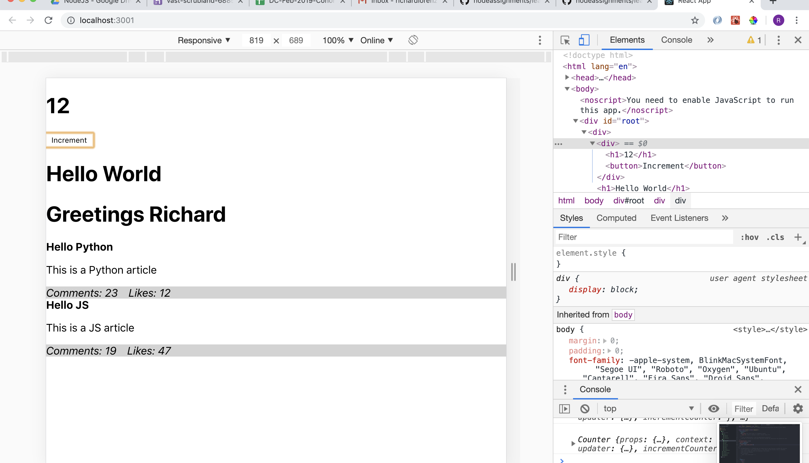

The result looks the same, but the code is quicker and easier to work with. Once we get into multiple states, you'll quickly appreciate using anonymous functions to manipulate your states within React. 

NOTE: React does not require you to write ```function incrementCounter()```. While inside the class, writing just ```incrementCounter()``` will work as React is designed to check the syntax and infer it as a function. Other languages may not allow this, such as JavaScript or Python. 
