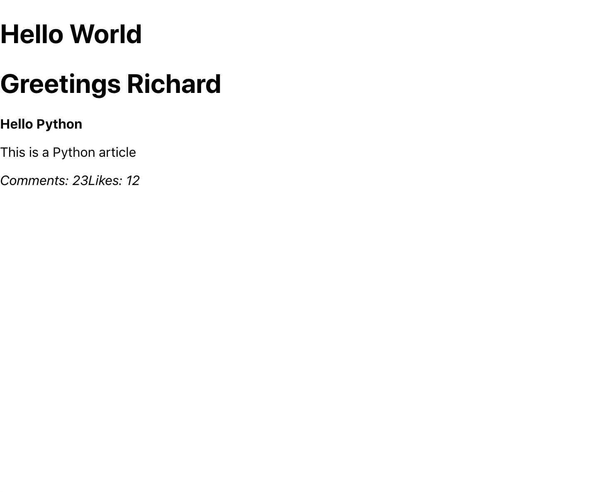

# React :: Initiating State 

As we have learned, React is purely front-end and based on changing the display through user input. Due to this, the initial loading time of the application will be longer but the functionality of the application will be faster. Without using a backend, React has to store the data locally. Since React never refreshes the application, this is achieved by setting what is called <b>The State</b>. Understanding states is roughly 90% of React. By the time you finish reading this, I will have given you a basic understanding of states and how React uses them.

## Quick Review 

You can set values to your Components in your main App.js. These values will then be displayed on your applicaiton.

 

We then apply styling to the Component, which is then imported into said Component. 

# Setting State in React 

As we have done before, we start by creating a new Component for our Counter. Creating a counter, which can increment a state, is a simple way to start understand React and states. Our goal is to click on the button and have the number increase per click. First, let's make sure we can display the button and counter Component. 

As we've learned before with Classes in JavaScript, a Class can have functions which can be called upon. 
