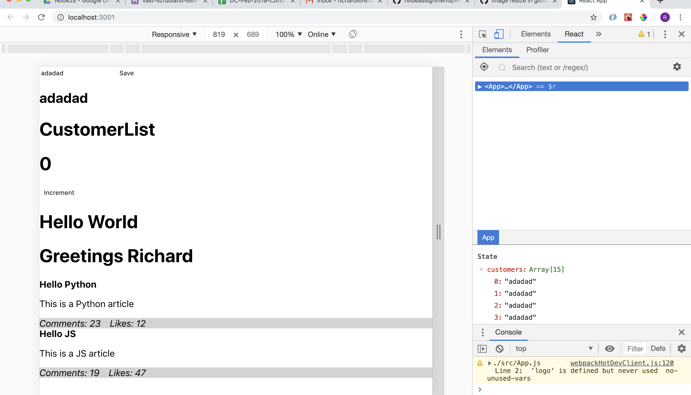

# React :: Initiating State 

As we have learned, React is purely front-end and based on changing the display through user input. Due to this, the initial loading time of the application will be longer but the functionality of the application will be faster. Without using a backend, React has to store the data locally. Since React never refreshes the application, this is achieved by setting what is called <b>The State</b>. Understanding states is roughly 90% of React. By the time you finish reading this, I will have given you a basic understanding of states and how React uses them.

## Quick Review 


You can set values to your Components in your main App.js. These values will then be displayed on your applicaiton.

 

We then apply styling to the Component, which is then imported into said Component. 


# Setting State in React 


As we have done before, we start by creating a new Component for our Counter. Creating a counter, which can increment a state, is a simple way to start understand React and states. Our goal is to click on the button and have the number increase per click. First, let's make sure we can display the button and counter Component. 


As we've learned before with Classes in JavaScript, a Class can have functions which can be called upon. When creating a function, it can be adventageous to console.log something in order to make sure you are able to call the function in the first place. 


Every time we click on the button, it will console.log "Counter". As we have seen, I clicked the button 34 times. It shows in the developer tools log, but we ultimately want it to display on the application. Before moving forward, we are going to have to create a constructor in order to assign our states. 

 

The ```super()``` function is required in this instance, since this is the parent class for Counter. The constructor now allows us to set values to THIS and STATE. 


If you recall classes in JavaScript, using a constructor will be familiar. By calling the constructor function, we are able to tell React which states we are going to set and manipulate. Since this is a counter, our state is going to be "count". We can assign multiple states under the constructor, but for now we will focus on a single state. 

# "Changing" The State 

NOTE: You cannot change the state in React. These values are inmutable, meaning unchangeable. React has specific syntaxes to work around this "issue". 

The first way to manipulate a state without changing the value is to define a function and tell React to apply this.Function to this.state.Function. Confused? So was I. 

 

On line 13, we create a function incrementCounter() and call it on line 26 ```onClick={incremenetCounter}```. Don't stress too much about the new syntax as it's how React calls functions and evaluates values. onClick must have the capital C, unlike in JavaScript, so if you run into error messages make sure your syntaxes are correct.

On line 10 we set our function to BIND to our state of this. Still confused? It definitely can be complicated to understand. Think of it like this: You are telling your function's state to have the value of the class's state. Without this line, the function's state for "this" will be undefined. 

 

Our counter now works, but we can simplify the functions and reduce the lines of code we need to write. 

 

Lines 13 through 18 replace the previous function and this.state we have set up above. We are using an anonymous function called incrementCounter and setting the state of count to increase every time the function is called. Like before, the button is still assigned to the function. 

## Anonymous Functions and Arrow Syntax 

**this** is the state of the class, function, etc you are working with. Everything you do will have a behind-the-scenes state, which can be called upon with **this**. In an object, you would do something like object.value. In your React classes, you will do **this.value** when calling upon states.

Why does designating a function and using an anonymous function with an arrow syntax look so different if they're doing the same thing? Because of **THIS**. This is not defined by the superceding value of the class when creating a function with standard syntax. **This** will be defined by the value of the function you just created inside of the class, which is currently undefined.

Using the arrow function ```=>``` will take the previous values for **this** and apply them into the function we are creating. The arrow function is extremely powerful is this way, allowing us to simplify functions and utilize previous states without needing any extra steps. The arrow function is not restricted to React alone, but this may be your first time utilizing an arrow function in such a manner. Just remember, if you ever need to carry a **state** or **this** value into a function, an arrow function is the way to go.


The result looks the same, but the code is quicker and easier to work with. Once we get into multiple states, you'll quickly appreciate using anonymous functions to manipulate your states within React. 

NOTE: React does not require you to write ```function incrementCounter()```. While inside the class, writing just ```incrementCounter()``` will work as React is designed to check the syntax and infer it as a function. Other languages may not allow this, such as JavaScript or Python. 

# Utilizing Multiple States 
## Arrays, Objects, and Values 

Being able to set the value of a single state and call upon it is great, but not realistic to what a full React-application can and will be doing. In JavaScript, we were taking multiple objects, arrays, and values and storing them into new arrays, then filtering and mapping through those arrays to display specific data. React can do all of that with states. 


On line 22, we are creating an input and button element and assigning an onChange property with the value of a function we are creating on line 16. Why is the syntax for the function so different? Since React does not require us to declare the function like JavaScript does, we can bypass writing extra lines of code. We can declare the name of the function and use React syntax to shorthand our functions. 

```functionName=(inputVariable)=>{code goes here}``` is the React syntax for 
```function functionName(inputVariable){code goes here}```. While React will accept you writing functions as you did in JavaScript, React is designed with its own syntax in mind (go figure). If you commit to using the JavaScript syntax, the more complicated your application gets the more lines of extra code you have to write to get anything done. If you plan to learn, and more importantly use, React you will need to commit to the React syntax and the JSX/ES6 syntax.

onChange (remember, must have the correct capitalization) tells React to pull and use the value of the input field as someone is typing into the input field. For example, if I am typing my name Richard, React will show the state changing as "R", "RI", "RIC", "RICH", and so on to "RICHARD". Our function on line 16 will show you how React interprets the onChange property, but it will not be what you expect.

# What is 'e'? 

e is not unique to React. e stands for event, and stores the value of the event. When you console.log(e), you'll see an object full of functions and data. e has a lot of utility, but doesn't display what we want from the start. Looking through the e object, we find e has a property "target" which has a property "value". 

 

Since our function is onChange for the input element, the target is the input and the value is the value of the input element. When we log e.target.value, we get the changing value for the input element. But... It still will not display what we want since we have not set a state.

 

By giving e.target.value a state, we have now told React to hold onto the input element's changing value for us. Now, instead of logging the line of code for the element, we get the actual input element's value. 


React now shows us what we put into the input field. This is a great first step as we now know this data is storing is a useable format. Storing the data isn't enough, as every website and application will also display data back to the client. Let's take the stored data and display it on our application.


You might notice we are not calling e.target.value into the h2 element I created on line 26. Our function on line 16 set the state of name to the value, so just like before we are calling upon the state itself. Now when we load the application and input a name, we get the value displayed on the page for our viewing pleasure. 


Lovely. We see the value of the state in the bottom right corner, in the input field, and on the page. 

Let's take it one step further. Let's store this information inside a state, then display the stored information. 

# Arrays and States 

Knowing states cannot have their values changed, filtering and mapping will no longer work since they modify the value of the array. Luckily, there is something called concatenate. Concatenate doesn't change the array, but makes an entirely new array with the new values. Now, we have an array outside of the state which has our values and can be freely manipulated. 

 

I set this.state.name to a variable so I don't have to keep typing this.state.name. You do not have to assign it to a variable, but if you use it in multiple places it will be faster and easier to use a variable. 

Looking at line 14, we have a new state called customers which is an empty array. An array which cannot be changed sounds quite useless to us, but as stated above we are cloing the array and modifying the new array with concatenate. 

We assign our button element to an onClick function and have that function concat the empty array with the input value of name. 

 

Our array's state now has fifteen iterations of "adadad". Glorious. Now, let's display the full array onto our page. 

 

We set our CustomerList element on line 37 to have a property customers, which has the value of our customers array. If this is looking familiar, that is because we are doing what we learned earlier. 

 

Our Component takes the value, which is done by evaluating this.props.customers (customers is the value we set to our Component's element up above). Arrays and objects are passed from parent to child the same way single values are. 

 

We displayed the array, but it looks... Horrible. React will simply throw out the values unless you tell it some form of styling. Let's revisit our Component and create a list... 

 

And then check what React does with our information.

 

Fantastic. As we add values to our array, the page is updated with the new values. Don't be mistaken; the page is not refreshing or doing a server call like in mustache-express. The page is changing what it is displaying to the user as the user provides information to the page. 

# To Summarize... 

React is not particularly hard when coming from a JavaScript background, but understand states can be a large obstacle in your learning experience. States allow React to store information locally without needing a server. As the user inputs information into the page, the states change and display dependent on the user's actions. If the page is refreshed, all states are reset to their original values designated by the JavaScript code. 
