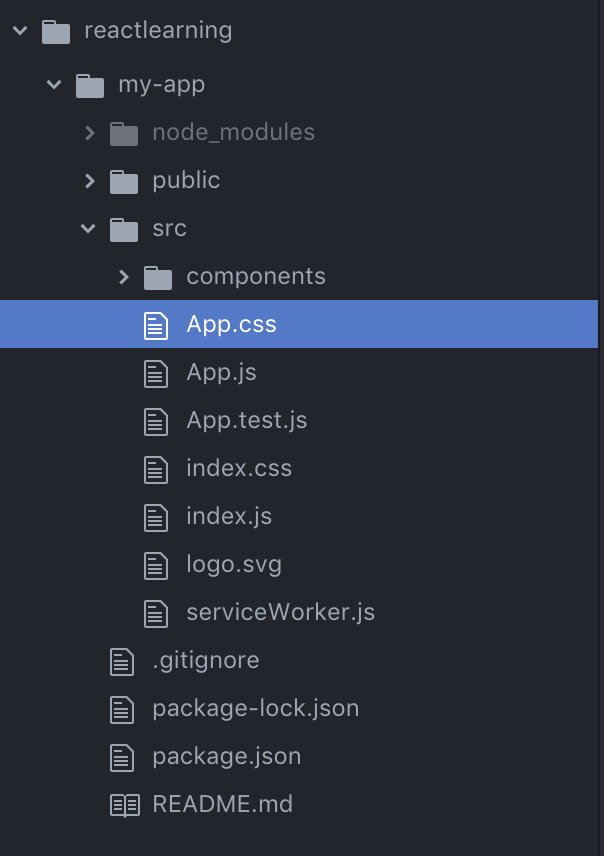
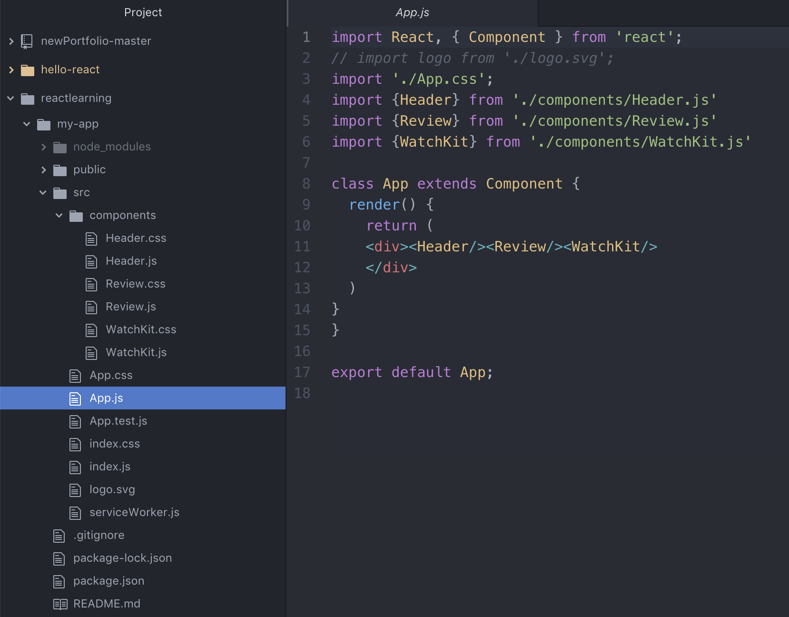
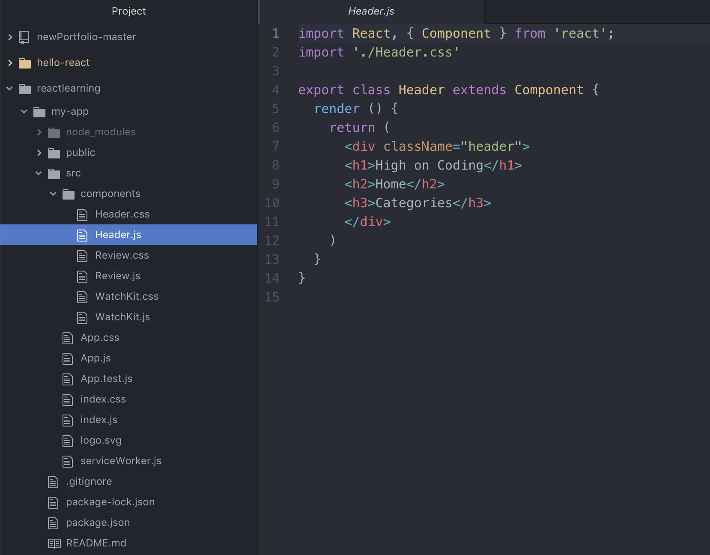
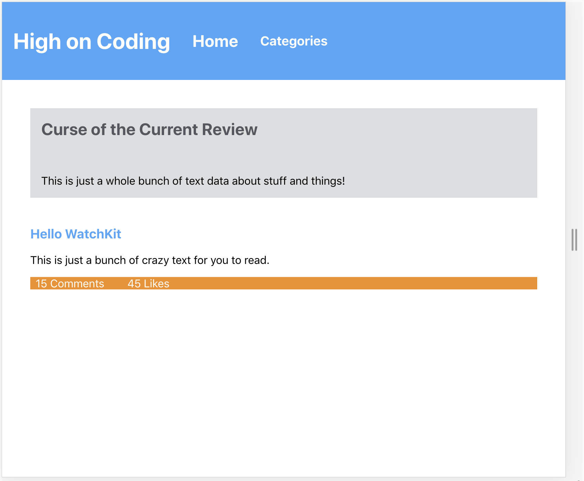
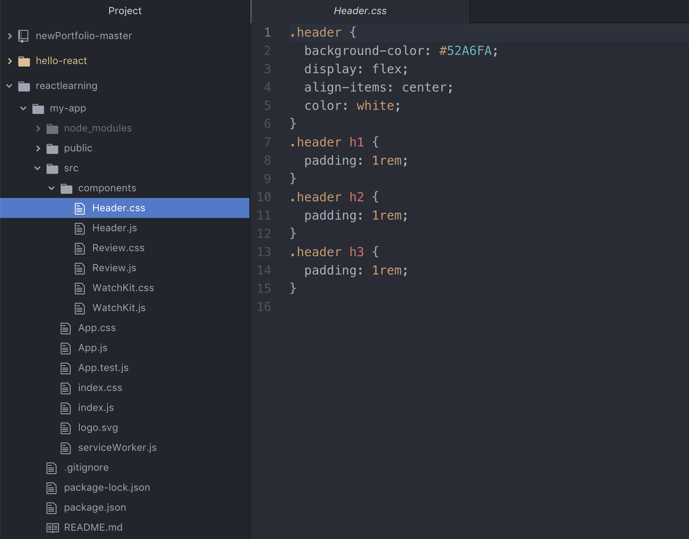

<h1>:zap:Learning React:zap:</h1>
 
[Dangerzone](http://caseyohara.github.io/campfire-sounds/sounds/dangerzone.mp3)
 
> Single Page Application for adaptive web design

* **Installing React**

To install React, open a terminal and type ```$ sudo npm install -g create-react```. This will install React as a global application which can be used in any project, but you still have to install React on a per-project basis.

Create a new folder on your desktop and navigate to the folder via the terminal. Once inside your working directory, type ```$ npx create-react-app my-app-name``` where **my-app-name** is the name of your project folder. This command can take a few minutes to fully execute, but once it is finished...

 

You will notice React installed a basic project template for you to work with. The only changes I have made from the pre-built project folder is the src/components folder, which I will cover later on.

For now, while inside of your working directory run ```$ npm start```.

* **What Is React?**

React is a single-page application language, which means the website or application is one giant user interface which changes its display based on the user's actions. React never refreshes the browser (the user has to manually refresh the browser), which means once fully loaded React will appear to run quicker and smoother than other applications. In mustache-express, you will create multiple mustache pages with post and get requests. In React, you will have a single HTML page. The HTML page can be found under public/index.html.

Just like in mustache, which used partials, React uses what are called Components. Components are individual pieces of a webpage which can communicate to one another and be displayed on multiple pages. Components are imported into your primary JavaScript file, which then renders the HTML page with all the Components. Due to the nature of Components, the smaller a Component is the better. If you want to use a header on multiple pages, your Component should only render that specific header and nothing else.

By default, App.js is your primary JavaScript file.



* **Get Started With Coding React**

Looking at the App.js file, we notice the first line ```import React, { Component } from 'react';```. This first line says App.js is importing the React amodules and the Component class from the react application. This is very similar to node.js, but React already has all the modules we need to use at the moment. Instead of doing ```const express = require('express')``` we now just import all of React at once.

This line is REQUIRED in all JavaScript Components which are using the superclass Components, which is pre-built with multiple functions by React. One of these functions, render(), is required for the class to work properly.



When we create our own Component, which I hace placed inside of the src/components folder for organizational purposes, we start with the same first line as in App.js. ```import React, { Component } from 'react';```

Looking back at the App.js file, we see on line 4 we are importing out {Header} class from the file ./components/Header.js. As you may be thinking, this means the Header.js file must export itself in order for App.js to use it. There are two main ways to export your classes. The first is the way App.js is exporting itself, which is on line 17.
```export default App;```
We are telling React to export JUST the class App from our App.js file, which is best used for single-class Component files. If you have multiple classes inside of your file, it is best to export the way we are doing it inside of Header.js on line 4.

```export class Header extends Component {```

This is telling React to export our Header class from our file Header.js, but does not restrict the file to exporting only one class.

As of now, we are going to stick with the Header.js format.

* **Understanding The Class System**

With React, classes are the primary way of sending data to your application. Components, as mentioned, is the superclass pre-built by React. When you see ```export class Header extends Component {``` this is stating we are creating a new class based off of a superclass called Component. Now, our new Header class has all the properties of the Component class.

One of these properties is mandatory, which is called the render function.

```export class Header extends Component {
render() {
return (
<h1>Hello World</h1>
)
}
}
```
We are now telling our Header.js file to export an HTML element of H1 stating "Hello World" to our App.js file. As you may have noticed, we are no longer using template literals like we did in express and mustache-express. This is called JSX, or JS XML. Remember this term, as it will come up in interviews later.

Now that we have something to render, how are we actually rendering it? Is it a local host? Well, yes it is. When we did ```npm start``` earlier, React was ran in the terminal and created a localhost. By default, it will run on port 3000. If port 3000 is in use, the terminal will as if you want to use a new port. Press y and enter, and React will open a webpage automatically as localhost:PORT. Note that any time you save any update to any project file React will automatically refresh the page, similar to when we ran nodemon.

If everything was written properly, you will see an HTML page with a bunch of errors. Go into the App.js file and under the render property type in ```<Header/>```. Our imported class Header is run as an HTML element, which is able to self-close. This is telling your App.js to render the Header class as an HTML element, which will now display "Hello World" on your localhost: 3000. We have now created a React page. (Don't worry about the HTML page at this point. The HTML portion will be covered later.)

* **High On Coding Assignment**



Using the same App.js and Header.js file, we need to insert multiple components into our index.html page and render a page.

NOTE: While the render function MUST have a return, the return can ONLY return a single parent element. This means you cannot do something like
```<h1>Hello World</h1><h2>Hello World</h2>```
but instead must do something like
```<div><h1>Hello World</h1><h2>Hello World</h2></div>```. The div element is now our most parent div, holding the h1 and h2 elements. This will now allow us to render everything without any error messages. Try rendering the page improperly first, then put everything inside a div. This is the required syntax for all JSX, whether inside of the App.js or your Components.

Looking at the Header.js file, you'll notice multiple HTML elements inside of a parent div with no styling. When we initially render the page, the elements will display down the left-hand side of the page with each element starting a new line. Not very appealing, so we need to add a class and styling.

NOTE: elements inside of React do not have classes, but instead have classNames. In the Header.js, you will notice I called the parent div className="Header". If we do class="Header", React will render the page but with an error message specifically telling you to change class to className.

On line 2 of our Header.js, we are importing our Header.css file. ```import './Header.css'```
We do not need to add ./components like we did in the App.js file since our Header.js file and Header.css file are both located inside of the /components folder. If you add the import line without creating the css file, React will give you an error message on your webpage. Create the Header.css file, and let's add some styling.



There is nothing new here. Treat the individual css files how you would have with your partials using mustache-express and public. When you create a Component, it might be a good idea to create a separate css file for the Component dependent on your needs and desired uses of said Component. If we wanted to use Header.js on multiple pages, having an individual Header.css file will save us a lot of time and effort. If this is a custom header for just one page, having the styling inside of the page's css file can be a better option.

* **In Closing...**

- [x] Single Page Application
- [x] Quick and Responsive User Interface
- [x] In High Demand
- [ ] ~~Faster Loadtime~~

React is a front-end language designed to render one webpage and display different elements based on the user's input. Even though the initial loading time may be longer, the experience during use will be faster due to the entire site already being downloaded into the user's browser. React uses Components to render different elements of the page, which can each be styled individually or together. Components are able to communicate to one another by assigning values to an element. The parent element, such as App.js, will assign the value which the subclass, Header.js, with insert the value.

React is also one of the most in-demand coding languages in the current job market, rivaled only by Angular. React has grown exponentially since its open-source release and has no signs of slowing down.

Though not shown in the review, a quick example would be if we wrote the following in App.js
```<div><Header firstName="Richard"/></div>```
and wrote this inside of Header.js
```export class Header extends Component {
  render() {
    let firstName = this.props.firstName
    let nameItem = firstName.map((fName)=>{
      return {fName}
    })
    return (
      <div>Hello There {nameItem}</div>
    )
  }
}
```
Now, when rendering the page, the firstName value of "Richard" will be inserted into the class Header. Class Header takes this.props.firstName (the syntax for getting the value from the parent class) and assigns it to the variable firstName. nameItem returns the value of firstName, and we insert nameItem into our div.

You could do ```<div>Hello There {this.props.firstName}</div>``` since we are using one value, but as we move into objects and arrays you will need to return the values you want to use as done above.

Be prepared, for tomorrow you are going to learn more about the HTML and transferring values between elements and components!
